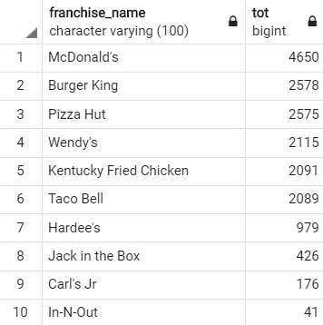
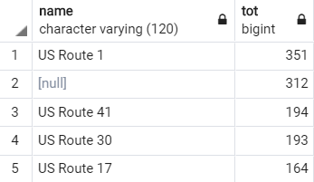

## 1、以空间思维思考
尽管各种地图网站提供了前所未有的交互式地图，但是使用他们仍然需要用户收集数据点然后放到地图上。  
使用地图只能依靠用户的视觉感知，当数据量大后，维护起来很麻烦。  

**空间数据库**：是一个定义了用于**存储几何对象**的特殊数据类型，并且可以存储几何数据到常规数据库表中的数据库。它提供了特殊的函数和索引使得可以通过SQL语句来查询和操作几何数据。空间数据库常常仅用作存储空间数据的容器，但是它能做到的远远不止这些。尽管空间数据库本质上可以不是关系型数据库，但是大部分有名的都是。  

空间数据库提供给你**两个工具**：存储工具和分析工具。
### 1.介绍几何数据类型
二维地图可以通过三种基本几何对象来组成：点、线串、多边形。

  

仅仅使用这三种对象，你就能在二维空间对任何东西建模。  
## 2、建模
空间查询：使用数据库查询的几何函数来回答空间和空间中的对象的相关问题的查询。  
## 3、介绍PostgreSQL和PostGIS
PostGIS是一个免费开源的库，它使得另一个免费开源的关系型对象数据库PostgreSQL空间可用。  
选择PostgreSQL作为PostGIS的开发平台的主要原因是：对创建新类型与操作和控制索引操作的**易扩展性**。   
### 1. PostgreSQL
它是一个拥有“皇族血统”的关系型对象数据库系统，可以追溯到关系数据库诞生的时候。  
独一无二的特性：
1. 支持许多语言来写数据库函数
2. 支持数组（然而Oracle、DB2也支持）
3. 表继承，类似对象的多继承
4. 定义处理多列的聚合函数的能力

还有一些企业级的高级特性。
### 2. PostGIS
将GIS添加到PostgreSQL中。它是由**Refractions Research**带头的一个项目。支持300多种空间操作、函数、数据类型和空间索引增强实现。  
PostGIS可以通过包含其他项目支持来增强。  
**OGC**：开放式地理空间协会（Open Geospatial Consortium），它的存在是为了标准化地理和空间数据的获取和发布。它有许多的规格来统一：在web服务中获取地理空间数据、地理空间数据的分发格式、查询地理空间数据。

**OSGeo**：开源地理空间基金会（Open Source Geospatial Foundation），它倡议储备、支持、推销开源工具、免费化GIS数据

## 4、开始使用PostGIS
### 1、安装
此书使用的版本：PostGIS1.3 or higher，PostgreSQL8.2 or higher。在附录B有安装指南。  
或者中文博客上的安装教程：  

1. **Windows**：https://blog.csdn.net/qq_35732147/article/details/86299060
2. **CentOS**：https://blog.csdn.net/qq_35732147/article/details/100708103

在CentOS上编译SFCGAL时遇到了`c++: internal compiler error: Killed (program cc1plus`这样的错误，最后查到应该是内存不足的原因，通过使用交换分区来解决，百度这个错误就能找到解决办法。  
手动安装PostGIS的过程很繁琐，需要小心的执行每个安装步骤。  

我在我的windows电脑和centos7服务器上都安装了PostgreSQL+PostGIS。不过主要用服务器来运行数据库，使用Windows上面的pgAdmin来做实验。

安装完成后，在Windows上打开pgAdmin4，会在浏览器中打开一个pgAdmin4的页面，设置好服务器、数据库的连接。然后点击选中一个数据库，再点最页面上面的**Tools**菜单项，选择**Query Tool**，就会打开一个执行SQL语句的tab。接下来执行：

	SELECT postgis_full_version();
如果输出了PostGIS依赖的各项插件的版本号，就说明安装成功了。查看PostgreSQL版本的命令是：

	SELECT version();
#### 注：再接下来的例子中，一般情况下也只会写出执行的SQL语句，而不给出它的输出结果的截图，只是因为太麻烦了。
### 2、使用PostGIS创建几何对象
首先以创建一个**点**为例子：

	SELECT ST_Point(1,2) as MyFirstPoint;
这样就会创建一个一个点(1, 2)。在这里我们并没有指定**空间参考系**，PostGIS默认空间参考系的是笛卡尔坐标系，也就是我们从小到大学的那种坐标系。但是在实际应用中指定空间参考系是非常重要的。  
PostGIS中有3000多个空间参考系（我实际查了一下，现在有5757个），由EPSG标准来给每一种参考系指定一个数字编号。可以在这个表中`spatial_ref_sys`查到，这个表好像是数据库自带的，不过我没有看到默认有这个，我是在之前的练习中导入数据时搞到的。    
接下来创建另一个点，这次指定了地理关联：  

	SELECT ST_SetSRID(ST_Point(-77.036548, 38.895108),4326);
这里使用`ST_SetSRID`函数指定了这个点是使用4326这个空间参考系，而这个参考系就是我们所知道的经纬度参考系（WGS 84）。

`ST_GeomFromText`函数提供了一种更通用的，以文本形式来创建几何对象的方法。这个函数相比于`ST_Point`这种专门的函数，效率慢、精度低。但是好处是更加直观和通用，适用于所有的几何类型：

	SELECT ST_GeomFromText('POINT(-77.036548 38.895108)', 4326);
使用这个函数创建几何类型时，文本内容当然不是随意写的，必须按照一定的格式。这个格式叫做WKT(Well-Known Text)几何表示方式。这种格式是OGC标准规定的。在PostGIS中，`ST_AsText`和`ST_GeomFromText`提供相反的操作，来实现：**几何类型<->文本**的转换。因为几何类型在数据库中是以二进制格式存储的，没有可读性。例如上面创建的对象可能是这个样子的： 

	0101000020E6100000FD2E6CCD564253C0A93121E692724340
使用`ST_AsText`或者`ST_AsEWKT`可以转换为文本格式。这两者之间略有不同，后者会多输出一个空间参考系的编号。  

然后我们来创建一个**线串**：

	SELECT ST_GeomFromText('LINESTRING(-14 21,0 0,35 26)') AS MyCheckMark;
可以看到线串就是一些点的序列而已。  
创建**多边形**和线串类似，不过多边形需要是一个闭合的线串，或者说是一个环。下面这个语句创建了一个三角形：

	SELECT ST_GeomFromText('POLYGON((0 1,1 -1,-1 -1,0 1))') As MyTriangle;
下面这个语句创建了一个心形：

	SELECT ST_GeomFromText('POLYGON((52 218, 139 82, 262 207, 245 261, 207 267, 
		153 207, 125 235, 90 270, 55 244, 51 219, 52 218))') As HeartPolygon;
在多边型的表示中，比线串格式多了一对小括号。因为多边形中可能存在“洞”，所以多边形可能有多条线串。

以上就是创建几何对象的基本操作了。

## 5、使用实际数据
在这一节会讲述如何从两种常见的格式来加载数据：

1. 分隔的ASCII数据
2. ESRI图形文件数据

这里提一下几何类型和地理类型：  

1. 地理类型：必须以经纬度的方式(WSG 84，SRID=4326)存储，距离的度量单位是米。能够使用的PostGIS函数较少，且效率不高。
2. 几何类型：可以以任何支持的空间参考系来存储，度量单位由空间参考系指定。能够使用的PostGIS函数多。

由于度量方式和计算方式不同，有时候必须在这两种类型之间进行转换。

### 1、加载以逗号分隔的数据
数据来源是一些快餐店的数据信息。在开始加载数据之前，需要先创建schema和表来存储数据。

	CREATE SCHEMA ch01;
	-- 创建快餐店名字和代号的映射表
	CREATE TABLE ch01.lu_franchises(
		franchise_code char(1) PRIMARY KEY,
		franchise_name varchar(100)
	);
	-- 插入一些数据
	INSERT INTO ch01.lu_franchises(franchise_code, franchise_name)
	VALUES ('b', 'Burger King'),
		('c', 'Carl''s Jr'),
		('h', 'Hardee''s'),
		('i', 'In-N-Out'),
		('j', 'Jack in the Box'),
		('k', 'Kentucky Fried Chicken'),
		('m', 'McDonald''s'),
		('p', 'Pizza Hut'),
		('t', 'Taco Bell'),
		('w', 'Wendy''s');
	
	-- 创建快餐店位置的表
	CREATE TABLE ch01.fastfoods(
		franchise_code char(1) NOT NULL,
		lat double precision,
		lon double precision
	);
其中：

1. schema是数据库实例下一层的一个概念，从逻辑上分割表、视图、函数这些对象。
2. 创建店名和代号的查找表。
3. 加入一些数据。
4. 创建存储地理位置信息的表。

可以使用PostgreSQL的内置函数`COPY`或者psql的`\copy`命令来将数据加载到数据库中。前者可以在任何可以运行SQL语句的客户端上使用，后者只能在psql客户端中使用。

使用COPY函数：

	COPY ch01.fastfoods FROM '/tmp/postgis/ch01/fastfoods.csv' DELIMITER ',';
使用psql的\copy命令：

	\copy ch01.fastfoods from '/data/fastfoods.csv' DELIMITER AS ','
这里要把路径替换成自己的。数据来源可以从本书网站上去下载。  
然后给fastfoods表添加一个主键：

	ALTER TABLE ch01.fastfoods ADD COLUMN ff_id SERIAL PRIMARY KEY;
### 2、空间化平面文件数据
首先，先为fastfoods表创建几何对象列：

	-- 创建几何对象列
	SELECT AddGeometryColumn('ch01', 'fastfoods', 'geom', 2163, 'POINT', 2);
	-- 用现有的经纬度数据来创建对应的几何对象
	UPDATE ch01.fastfoods SET geom = ST_Transform(
		ST_GeomFromText('POINT(' || lon || ' ' || lat || ')', 4326), 
		2163);
	-- 为几何对象创建空间索引
	CREATE INDEX idx_fastfoods_geom ON ch01.fastfoods USING GIST(geom);
然后，再为fastfoods表创建地理对象列：

	-- 这里使用PostgeSQL内置的特性来添加新列，而不是前面的AddGeo..函数
	ALTER TABLE ch01.fastfoods ADD COLUMN geog geography(POINT, 4326);
	UPDATE ch01.fastfoods SET geog = 
		ST_GeogFromText('SRID=4326;POINT(' || lon || ' ' || lat || ')');
	CREATE INDEX idx_fastfoods_geog ON ch01.fastfoods USING GIST(geog);
一个良好的习惯，在执行批量加载操作后执行一次清理：

	vacuum analyze ch01.fastfoods;
清理操作会删除掉已经无用的列，并且更新统计信息。如果不显示调用的化，会由服务器上的vacuum守护进程定期清理。  
为了防止fastfoods表中的店名代号被错误添加或者修改，为它添加约束：
	
	ALTER TABLE ch01.fastfoods 
		ADD CONSTRAINT fk_fastfoods_franchise
		FOREIGN KEY (franchise_code)
		REFERENCES ch01.lu_franchises(franchise_code)
		ON UPDATE CASCADE ON DELETE RESTRICT;	
这种语句其实不用记住背过，在图形界面下直接就能通过点点点来生成。

### 3、从空间数据源加载数据
最常用的发布空间数据的格式是ESRI的图形文件格式。  
加载这种文件格式的数据时，在Windows上需要用到**PostGIS 2.0 Shapefile and DBF Loader Exporter**这个程序，它会随安装PostGIS时一块安装好。打开它后，需要以下几步操作：

1. 点击**View connection details...**设置好PostgreSQL数据库的信息。
2. **在Import** tab中点击**Add File**，选择.shp文件，然后修改schema为ch01和srid为4269。
3. 在**Options...**中把两个选中的选项去掉。
4. Import。

在Linux上可以使用pgsql安装目录下的shp2pgsql程序来加载：

	shp2pgsql -s 4269 -g geom_4268 /tmp/postgis/ch01/roadtrl020.shp ch01.roads | psql -h localhost -U postgres -p 4096 test
虽然这个命令很长，但是拆解开后还是很好理解的。完成后会在schema ch01创建下一个新表`roads`，这个表中包含导入的数据。  
这里指定的是SRID=4269，它和4326非常相似，在大部分情况下是可以替换使用的。接下来要把4269参考系转换为2163的：
	
	SELECT AddGeometryColumn('ch01', 'roads', 'geom', 2163, 'MULTILINESTRING', 2);
	UPDATE ch01.roads SET geom = ST_Transform(geom_4268, 2163);
	SELECT DropGeometryColumn('ch01', 'roads', 'geom_4268');
	CREATE INDEX idx_roads_geom ON ch01.roads USING GIST(geom);
在这里把2163写成了2613，找错误找了贼久，一定要仔细啊。

在加载完成后不要忘记执行一次：

	VACUUM ANALYZE ch01.roads;
在可以在加载的时候选择直接加载为地理类型，在Windows上只需要把**Options...**中的Load into
geography column选中即可。

在Linux上执行：

	shp2pgsql -G -g geog /tmp/postgis/ch01/roadtrl020.shp ch01.roads_geog | psql -h localhost -U postgres -p 4096 test
和加载为几何类型时非常相似，只有少许改动。

## 6、使用空间查询分析数据
到目前为止我们已经把数据加载到数据库中了，接下来使用标准统计SQL查询来分析数据。  
### 1、邻近查询
空间数据库的最常用方式之一就是查询对象的邻近性。接下来是一些练习问题：  
注：1英里=1609米
#### 1）有多少连锁快餐店在主要的高速公路一英里范围内？
注意：ST_DWithin函数对于几何类型和地理类型是都可以使用的。

	SELECT ft.franchise_name, COUNT(DISTINCT ff.ff_id) AS tot	-- 数出每种快餐店出现了多少次，DISTINCT用于确保同一家店不会被计算两次
	FROM ch01.fastfoods AS ff
		INNER JOIN ch01.lu_franchises AS ft		-- 非空间连接，根据代号找出对应的快餐店名
		ON ff.franchise_code = ft.franchise_code
		INNER JOIN ch01.roads AS r				-- 空间连接，找出在主干高速公路1英里范围内的快餐店
		ON ST_DWithin(ff.geom, r.geom, 1069*1)
	WHERE r.feature LIKE 'Principal Highway%'	-- 定位主干高速公路
	GROUP BY ft.franchise_name					-- 对查找出的结果，按照快餐店名字分组
	ORDER BY tot DESC;							-- 按照出现次数降序排序
查询的结果如下：  

#### 2）哪条高速公路在半英里半径内，有最多数量的快餐店

	SELECT r.name, COUNT(DISTINCT ff.ff_id) AS tot	-- 数出每种快餐店出现了多少次，DISTINCT用于确保同一家店不会被计算两次
	FROM ch01.fastfoods AS ff
		INNER JOIN ch01.roads AS r				-- 空间连接，找出在主干高速公路半英里范围内的快餐店
		ON ST_DWithin(ff.geom, r.geom, 1069*0.5)
	WHERE r.feature LIKE 'Principal Highway%'	-- 定位主干高速公路
	GROUP BY r.name								-- 对查找出的结果，按照高速公路名字分组
	ORDER BY tot DESC							-- 按照出现次数降序排序
	LIMIT 5;									-- 这里只给出前5条高速公路
查询的结果如下：  

结果中的null是没问题的，因为有些高速公路就是没有名字数据的。

### 2、使用OpenJUMP可视化数据
PostGIS除了擅长于实现只查看地图不可能完成的快速空间分析，还可以可视化数据源，创建附加的适用于在地图上标记出关键区域的衍生出的几何对象。  
在PostGIS中经常用于可视化的一个函数是`ST_Buffer`。  
接下来是一个例子，用于找出高速公路US Route 1在MaryLand州这一段中，10英里范围内的Hardee快餐店有几家：

	SELECT COUNT(DISTINCT ff.ff_id) AS tot
	FROM ch01.fastfoods AS ff
		INNER JOIN ch01.roads AS r
		ON ST_DWithin(ff.geom, r.geom, 1609*10)
	WHERE r.name='US Route 1' AND ff.franchise_code='h' AND r.state='MD';
结果是3。  

**后面一些内容需要使用OpenJUMP才有效果，但是OpenJUMOP需要到12章才讲，所以这里先不写了。**

## 7、总结
在本章初步认识了空间关系数据库，以及它是怎么嵌入到关系数据库中的。提出了使用空间结构来对真实世界进行建模的思想。展示了PostgreSQL/PostGIS如何用于分析数据的空间模式。  
给出了几个简单的例子来展示PostGIS的用法。  
