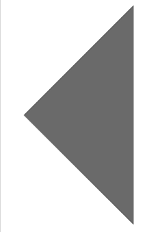
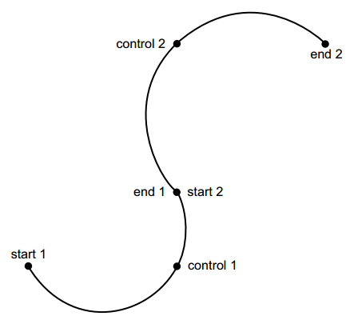
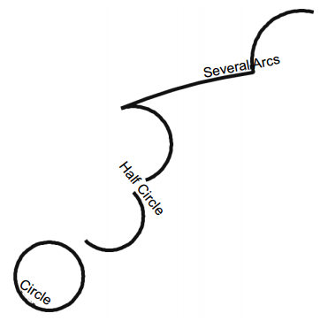
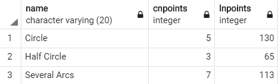
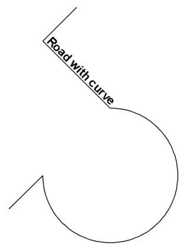
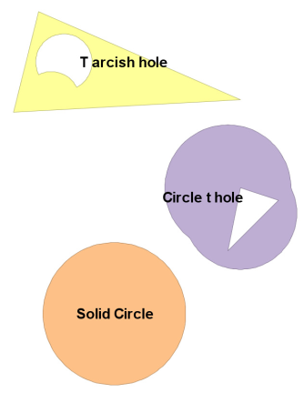

本节会解释PostGIS是如何管理在数据库中存储的几何数据的。
## 1、PostGIS中的几何列
PostGIS对pgsql进行扩展，引入了几何数据类型。并且可以把几何数据类型和pgsql中的原生数据类型同等对待。  
pgsql有自己原生的几何数据类型，但它们和PostGIS是不兼容的，并且也没有第三方的可视化支持。这些原生几何类型自pgsql诞生起就存在了，但是它们并不遵从OpenGIS联合体的标准，也不支持空间坐标系。  
### 1、geometry_columns表
PostGIS使用一个叫做geometry_columns的表来存储在当前数据库中的和几何列相关联的元数据。这些元数据一般是被第三方工具用来收集数据库中的几何层信息的。  
当被展示到地图应用程序时，空间表中的几何列常常被解释为层或者特征类。  
这个表中有七列，分别是：

1. f_table_catalog：数据库名
2. f_table_schema：schema名
3. f_table_name：表名
4. f_geometry_column：几何列名
5. coord_dimension：几何坐标维度-2,3,4维
6. SRID：空间参考系ID
7. type：几何对象的类型

其中：

1. **坐标维度**最多支持到4维，并且第4维并不是空间的，而常常被当做是M(measure)坐标。PostGIS中所有的几何操作都把第四维看做是额外的属性，而不是空间维度。例如时间维度。
2. **SRID**是空间参考系标识符，是一个整数，可以在**spatial_ref_sys**表中查到对应的相关信息，并且它是该表的主键。还有另外一种表示方法叫做SRS ID，由作者名+唯一表示符来表示。例如，SRID=4326表示经纬度空间参考系，使用SRS ID表示法是EPSG:4326。其中EPSG是一个标准组织的名字。即使使用不同的SRID，也不能改变POSTGIS下层空间参考系是矩形笛卡尔系的事实。当处理地理类型时，这个问题会突显出来。在OGC标准中，未知的SRID用0表示。我们也可以自己定义空间参考系然后加入到 **spatial_ref_sys**表中
3. **type**的值可以是：POINT、LINESTRING、PLOYGON、MULTIPOINT、....、GEOMETRY这些。

**强烈建议**：不要直接修改geometry_columns表。

### 2、和geometry_columns表交互
为了避免直接修改geometry_columns表，PostGIS提供了五个函数来和geometry_columns表交互：

1. `AddGeometryColumn`：添加一个几何列到指定表中，并且添加相关元信息到eometry_columns表。
2. `DropGeometryTable`：删除一个表中的几何列。
3. `UpdateGeometrySRID`：更新表中几何列的SRID。例如当写错了SRID时，可以用这个来修正。
4. `Probe_Geometry_Columns`：它不会销毁任何geometry_columns表中已经存在的信息，而只是**添加有效的条目**。不能用于视图。
5. `Populate_Geometry_Columns`：比上一个更复杂一点。它通过检查视图和缺少几何约束的表来添加geometry_columns的元数据。如果不带任何参数调用这个，会把geometry_columns表中的内容全部删除，然后重新填充，消耗时间会很长。

到目前为止我们是通过`AddGeometryColumn`来添加几何列的。尽管不使用它也能添加几何列，但是在PostGIS2.0版本以前，强烈推荐使用这个。因为它不仅会添加几何列，还会自动维护geometry_columns表。如果使用pgsql原生的方法来添加几何列，需要的操作很多，如果忘了一步就会产生麻烦。

## 2、几何类型全览
本节会详细介绍PostGIS中的所有几何类型。
### 1、什么是几何
在本书中，使用几何来表示GIS中使用的泛化的几何形状和PostGIS中的几何数据类型。  
PostGIS的几何数据类型遵从OpenGIS标准的几何定义。下面以几个例子看一下：  
首先创建一个表来存储将展示的所有几何对象：

	CREATE TABLE my_geometries (
		id SERIAL NOT NULL PRIMARY KEY,
		name varchar(20)
	);
这里没有指定schema，则直接放在public schema中。pgsql的schema搜索默认是从public开始的。

### 2、点
PostGIS中所有的几何类型都是基于笛卡尔坐标系的。例如：2D(X,Y),3D(X,Y,Z),2DM(X,Y,M),3DM(X,Y,Z,M)。  
M坐标是一个附加的双精度数值型值。它可以存储到几何对象的任何点中。可正可负，并且它的单位不需要和所在的空间参考系有任何关系。目前就有两种类型2DM,3DM。  
接下来在之前创建的表中添加一个点几何类型列，并且插入几个点：

	SELECT AddGeometryColumn('public', 'my_geometries', 'my_points', -1, 'POINT', 2);
	INSERT INTO my_geometries (name,my_points)
	VALUES ('Home',ST_GeomFromText('POINT(0 0)'));
	INSERT INTO my_geometries (name,my_points)
	VALUES ('Pizza 1',ST_GeomFromText('POINT(1 1)')) ;
	INSERT INTO my_geometries (name,my_points)
	VALUES ('Pizza 2',ST_GeomFromText('POINT(1 -1)'));
添加了三个点到表中。

### 3、线串
线串至少有两个不同的点来定义。线串根据包含的点的维度不同也有四种不同的变形。接下来在表中添加线串的列：  

	SELECT AddGeometryColumn('public', 'my_geometries', 'my_linestrings', -1, 'LINESTRING', 2);
	INSERT INTO my_geometries (name,my_linestrings)
	VALUES ('Linestring Open',
	ST_GeomFromText('LINESTRING(0 0,1 1,1 -1)'));
	INSERT INTO my_geometries (name,my_linestrings)
	VALUES ('Linestring Closed',
	ST_GeomFromText('LINESTRING(0 0,1 1,1 -1, 0 0)'));
添加了两条线串到表中，一条开放的，一条闭合的。闭合线串是创建多边形的基础。  
当描述线串时会有**简单**和**非简单**几何对象的概念。除了起止点外，如果线串自身没有相交，那就是简单的，否则是非简单的。ST_IsSimple函数可以来判断是否是简单的。

	SELECT ST_IsSimple(ST_GeomFromText('LINESTRING(2 0,0 0,1 1,1 -1)'));
### 4、多边形
多边形是通过我们之前熟悉的其他几何类型组成的。接下来我们创建一个如下图的三角形：

这个三角形由一条闭合的线串+由该线串包围的所有点构成。线串叫做这个多边形的外环。

	SELECT AddGeometryColumn('public','my_geometries', 'my_polygons',-1,'POLYGON',2);
	INSERT INTO my_geometries (name,my_polygons)
	VALUES ('Triangle', ST_GeomFromText('POLYGON((0 0, 1 1, 1 -1, 0 0))'));
很多情况下，多边形只有一个环，但是多边形是可以有多个来组成的。每个外环可以有0个或多个内环，这些内环构成了多边形的“洞”。接下来创建一个带两个洞的多边形：

其中阴影部分是多边形，空白部分是多边形的洞。

	INSERT INTO my_geometries (name,my_polygons)
	VALUES ('Square with 2 holes',
		ST_GeomFromText('POLYGON(
		(-0.25 -1.25,-0.25 1.25,2.5 1.25,2.5 -1.25,-0.25 -1.25),
		(2.25 0,1.25 1,1.25 -1,2.25 0),(1 -1,1 1,0 0,1 -1))'));
因此多边形的文本表示形式中会有多一对小括号。即使你的多边形只有一个环也要加上。  
对于多边形来说，存在有效性的概念。有效多边形的环应该不相交或者只在不同的点上有相交。

### 5、容器几何类型
这个名字还有待商榷，英文是Collection geometries。  
想象这么一种情况，假设要把美国的每个州都用几何对象表示出来。那么处理夏威夷的时候就有问题了，因为它是由5个分开的块组成的。如果我们把这一个州用5个多边形来表示，那么存储格式就会很麻烦了。  
为了解决这个问题，OGC标准和PostGIS都提供了容器几何类型。它将多个分开的几何对象在逻辑上组合起来。  
对于每一种单独的几何数据类型，都有一个容器类型：  

1. point->multipoints
2. linestring->multilinestrings
3. polygon->multipolygons

除了这些还存在一个`geometrycollection`类型，可以存储任何的几何类型，前提是它们有相同的空间参考系和空间维度。

#### 1）multipoints
这个就只是存储多个点的容器而已。使用WKT语法表示multipoints有以下几种类型：

1. 2D：MULTIPOINT(-1 1, 0 0, 2 3)
2. 2DM：MULTIPOINTM(-1 1 4, 0 0 2, 2 3 2)
3. 3D：MULTIPOINT(-1 1 3, 0 0 1, 2 3 1)
4. 3DM：MULTIPOINT(-1 1 3 4, 0 0 1 2, 2 3 1 2)

注意2DM那种是有区别的。  
另外还有一种格式，以2D为例：MULTIPOINT((-1 1), (0 0), (2 3))。和上面的格式对比，只是对于每一个点都加了一对小括号。以上两种格式在PostGIS中都可以作为输入格式。但是以文本输出格式是不带小括号那种。

#### 2）multilinestrings
这个就是存储线串的容器。有以下几种格式：

1. 2D：MULTILINESTRING((0 0,0 1,1 1),(-1 1,-1 -1))
2. 2DM：MULTILINESTRINGM((0 0 1,0 1 2,1 1 3),(-1 1 1,-1 -1 2))
3. 3D：MULTILINESTRING((0 0 1,0 1 2,1 1 3),(-1 1 1,-1 -1 2))
4. 3DM：MULTILINESTRING((0 0 1 1,0 1 1 2,1 1 1 3),(-1 1 1 1,-1 -1 1 2))

注意这里的小括号是不能省略的，要不就成了点容器了。

对比之前所说过的线串的简单性，multilinestrings也有简单性的概念：

1. 容器中的每个线串都必须是简单的。
2. 容器中的每两个线串之间不相交。

否则就是非简单的。

#### 3）multipolygons
在多边形容器的文本表示法中，会有很多的小括号。每对小括号都表示多边形的一个环。然后再有一对小括号表示一个多边形。再有一对小括号表示multipolygons。下面照样是几种表示格式：

1. 2D：MULTIPOLYGON(((2.25 0,1.25 1,1.25 -1,2.25 0)), ((1 -1,1 1,0 0,1 -1))) 
2. 2DM：MULTIPOLYGONM(((2.25 0 1,1.25 1 2,1.25 -1 1,2.25 0 1)), ((1 -1 1,1 1 2,0 0 3,1 -1 4)) )
3. 3D：MULTIPOLYGON(((2.25 0 1,1.25 1 1,1.25 -1 1,2.25 0 1)), ((1 -1 2,1 1 2,0 0 2,1 -1 2)) )
4. 3DM：MULTIPOLYGON(((2.25 0 1 1,1.25 1 1 2,1.25 -1 1 1,2.25 0 1 1)), ((1 -1 2 1,1 1 2 2,0 0 2 3,1 -1 2 4))

对比之前所说的多边形的有效性，multipolygons也有有效性的概念：

1. 容器中的每个多边形都必须是有效的。
2. 容器中的每两个多边形不能互相覆盖。在第四章会详细的说覆盖的概念。

#### 4）geometrycollection
geometrycollection可以包含PostGIS中任何已知的几何类型，目前这里的**任何**表示单独的几何类型+它们对应的容器几何类型+geometrycollection。并且包含的几何类型不需要是相同的。  
对于存储来说，这种可以包含任意类型的容器是很棒的。但是对于很多PostGIS的函数来说对这种容器是没有意义的。  
例如你可以计算多个多边形的面积，但是你不能计算一个线串和一个多边形的面积吧。  

geometrycollection起源于作为查询的返回结果，而不是表中预定义好的列。要尽量避免在表设计时使用这个，但是在处理数据时要考虑到它的存在。

下面给出一些例子：

	SELECT ST_AsText(ST_Collect(the_geom))
	FROM (
		SELECT ST_GeomFromText('MULTIPOINT(-1 1, 0 0, 2 3)') As the_geom
		UNION ALL
		SELECT ST_GeomFromText('MULTILINESTRING((0 0,0 1,1 1), (-1 1,-1 -1))') As the_geom
		UNION ALL
		SELECT ST_GeomFromText(
			'POLYGON(
					(-0.25 -1.25,-0.25 1.25, 2.5 1.25,2.5 -1.25,-0.25 -1.25),
					(2.25 0,1.25 1,1.25 -1,2.25 0),
					(1 -1,1 1,0 0,1 -1)
			)'
		) As the_geom
	) As foo;
以上SQL代码创建了一个geometrycollection，下面是它的输出结果：

	GEOMETRYCOLLECTION(
		MULTIPOINT(-1 1,0 0,2 3),
		MULTILINESTRING((0 0,0 1,1 1),(-1 1,-1 -1)),
		POLYGON((-0.25 -1.25,-0.25 1.25,2.5 1.25,2.5 -1.25,-0.25 -1.25),(2.25 0,1.25 1,1.25 -1,2.25 0),(1 -1,1 1,0 0,1 -1))
	)
下面是另外一个例子：

	SELECT ST_AsEWKT(ST_Collect(the_geom)) 
	FROM (
		SELECT ST_GeomFromEWKT('MULTIPOINTM(-1 1 4, 0 0 2, 2 3 2)') As the_geom
		UNION ALL
		SELECT ST_GeomFromEWKT('MULTILINESTRINGM((0 0 1,0 1 2,1 1 3), (-1 1 1,-1 -1 2))') As the_geom
		UNION ALL
		SELECT ST_GeomFromEWKT(
			'POLYGONM(
				(-0.25 -1.25 1,-0.25 1.25 2, 2.5 1.25 3,2.5 -1.25 1,-0.25 -1.25 1),
				(2.25 0 2,1.25 1 1,1.25 -1 1,2.25 0 2),
				(1 -1 2,1 1 2,0 0 2,1 -1 2)
			)'
		) As the_geom
	) As foo;
输出结果为：

	GEOMETRYCOLLECTIONM(
		MULTIPOINTM(-1 1 4,0 0 2,2 3 2),
		MULTILINESTRINGM((0 0 1,0 1 2,1 1 3),(-1 1 1,-1 -1 2)),
		POLYGONM(
			(-0.25 -1.25 1,-0.25 1.25 2,2.5 1.25 3,2.5 -1.25 1,-0.25 -1.25 1),
			(2.25 0 2,1.25 1 1,1.25 -1 1,2.25 0 2),(1 -1 2,1 1 2,0 0 2,1 -1 2)
		)
	)
在第一个例子中是2D的，对应使用`ST_AsText`和`ST_GeomFromText`来做序列化和反序列化。  
在第二个例子中是2DM的，对应使用`ST_AsEWKT`和`ST_GeomFromEWKT`来做序列化和反序列化。  

这是因为在兼容OGC标准的函数中，`ST_AsText`和`ST_GeomFromText`只是被设计为用于2D的。`ST_AsEWKT`和`ST_GeomFromEWKT`是PostGIS创建的，可以应用于任何维度的。其中E表示扩展的。使用这种扩展的函数还有另外一个好处是它还会返回它已经的空间参考系的标识符。

geometrycollection的有效性只有一条规则：

- 容器中的每个元素都是有效的。

不满足这个规则则不是有效的。

### 6、曲线几何
在PostGIS1.3开始，提供了基本的曲线几何的支持。曲线几何是在**OGC SQL-MM Part 3规范**中引入的。在PostGIS中曲线几何还远不如其他几何类型成熟，并且也没有被广泛支持。自然的陆地特征很少表现为曲线几何，人造的结构和边界确实会有曲线，但是在许多建模例子中，都可以被约等于为直线。  
在很多情况下，尽管实际情况是曲线，但是使用线串更加合适。因为处理速度往往比精度更重要。

使用曲线几何的一些注意事项：

1. 很少的第三方工具支持曲线几何，无论是开源还是商业的。
2. PostGIS中许多函数使用的高级空间库**GEOS**不支持曲线几何。一个应变方法是使用`ST_CurveToLine`和`ST_LineToCurve`来做曲线和线串的相互转换，但是这样会丢失一下处理效率和精度。
3. 许多PostGIS函数不支持曲线几何。
4. 曲线几何不被PostGIS支持，所以使用它很可能是有BUG的。不过在后期的版本中很可能会修复许多BUG，并且扩展许多函数。

既然曲线几何有这么多缺点，那么为什么还要使用它呢？有以下几种原因：

1. 可以使用很少的几个点来表示一个曲线几何对象。
2. 许多工具将会引进曲线几何。
3. PostGIS正在增加对曲线几何的支持。
4. 曲线几何在一些情况下很重要，例如对人造结构进行建模时。
5. 尽管不用曲线几何存储数据，但是使用曲线几何WKT格式作为中间媒介画一个四分之一圆是很有用的，然后可以使用`ST_CurveToLine`函数来转换成多边形。

简单来说，你可以认为在PostGIS中，曲线几何就是带弧的几何类型。  
为了创建一个弧，必须有三个不同的点：起点、终点、控制点。控制点用于控制弧的曲率。如下图所示：

#### 1）CIRCULARSTRING
由多条弧首尾相连构成了另外一种曲线几何类型**circularstring**（圆环串），上图就是一个很好的例子。   
circularstring是所有曲线几何类型中最简单的，仅仅只包含了弧。

下面给出一个创建circularstring的例子：

	SELECT AddGeometryColumn ('public','my_geometries',
		'my_circular_strings',-1,'CIRCULARSTRING',2);
		
	INSERT INTO my_geometries(name, my_circular_strings)
	VALUES 
		('Circle', ST_GeomFromText('CIRCULARSTRING(0 0,2 0, 2 2, 0 2, 0 0)')),
		('Half Circle', ST_GeomFromText('CIRCULARSTRING(2.5 2.5,4.5 2.5, 4.5 4.5)')),
		('Several Arcs', ST_GeomFromText('CIRCULARSTRING(5 5,6 6,4 8, 7 9, 9.5 9.5, 11 12, 12 12)'));
上面创建的曲线几何对象如下图所示：

下面的代码计算出已曲线表示和已线串表示需要的点的个数：

	SELECT 
		name,
		ST_NPoints(my_circular_strings) As cnpoints,
		ST_NPoints(ST_CurveToLine(my_circular_strings)) As lnpoints
	FROM my_geometries
	WHERE my_circular_strings IS NOT NULL;
结果如下：

#### 2）COMPOUNDCURVES
由圆环串（circularstring）和线串以一定序列构成的几何容器，叫做**复合曲线**。由复合曲线构成的多边形叫做**曲线多边形**，例如圆角矩形。

下面是一个创建复合曲线的例子：

	SELECT AddGeometryColumn ('public','my_geometries','my_compound_curves', -1,'COMPOUNDCURVE',2);
	INSERT INTO my_geometries(name,my_compound_curves)
	VALUES (
		'Road with curve', ST_GeomFromText('COMPOUNDCURVE((2 2, 2.5 2.5),
			CIRCULARSTRING(2.5 2.5,4.5 2.5, 3.5 3.5), (3.5 3.5, 2.5 4.5, 3 5))'));
创建的复合曲线如下：

#### 3）CURVEPOLYGON
**曲线多边形**是一个使用圆环串作为外环或者内环的多边形。下面是一个创建曲线多边形的例子：

	SELECT AddGeometryColumn ('public','my_geometries', 'my_curve_polygons',-1,'CURVEPOLYGON',2);
	INSERT INTO my_geometries(name,my_curve_polygons)
	VALUES 
		('Solid Circle', ST_GeomFromText('CURVEPOLYGON(
			CIRCULARSTRING(0 0,2 0, 2 2, 0 2, 0 0))')),
		('Circle t hole', ST_GeomFromText('CURVEPOLYGON(CIRCULARSTRING(2.5 2.5,4.5 2.5,
					4.5 3.5, 2.5 4.5, 2.5 2.5), (3.5 3.5, 3.25 2.25, 4.25 3.25, 3.5 3.5) )') ),
		('T arcish hole', ST_GeomFromText('CURVEPOLYGON((-0.5 7, -1 5, 3.5 5.25, -0.5 7),
			CIRCULARSTRING(0.25 5.5, -0.25 6.5, -0.5 5.75, 0 5.75, 0.25 5.5))'));
创建的曲线多边形如下：

### 7、3D几何类型
PostGIS可以识别和存储3D几何对象，但是对它的支持还是有很多缺陷的。  
在之前的例子中我们看到，可以很容易的创建3D的点、线串、多边形等。但是要明白它们是缺乏体积的感知的。它们只是把2D中的点放到了3D空间而已，或者叫做2.5D。

使用3D几何类型的一些注意事项：

1. PostGIS和底层的GEOS库对3D几何类型有很少的支持。例如所有的关系操作符仅仅只是检查相应的2D维度，而完全忽略Z坐标。
2. 上层函数例如求交、求并仅仅部分处理第三维。
3. 空间操作实现的很棒的速度，通过使用边界框索引。不幸的是现在边界框索引还不支持第三维。

## 3、总结
本章所讲的内容：

1. geometry_columns元表
2. 5个和geometry_columns元表交互的函数
3. 点、线串、多边形
4. 点容器、线串容器、多边形容器、几何类型容器
5. 曲线几何和3D几何

在建模的时候不要想太严格的定义。例如，如果看起来、感觉是多边形，那么就把它当做多边形。不要对内环，外环过分担心除非你特别需要。